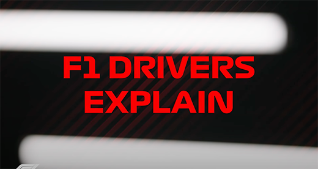

```{r, echo=FALSE, eval=TRUE, include=TRUE, message=FALSE, warning=FALSE, cache=FALSE}
library(tidyverse)
library(stringr)
library(magrittr)
library(htmltools)
library(ggplot2)
library(ggthemes)
library(DT)
library(leaflet)
library(leaflet.extras)
library(sf)
library(rgdal) # for reading shape files into R
library(rgeos)
library(maps)
# Please run following command in R-Studio to target
#  appropriate command for "crosstalk" package
#  otherwise an "All" entry will appear in filter
#  select dropdown
# devtools::install_version("crosstalk", version = "1.1.1")
library(crosstalk)
library(tidyr)
library(networkD3)
library(plotly)
library(lubridate)
#knitr::opts_chunk$set(fig.width=unit(9,"cm"), fig.height=unit(11,"cm"))
#https://sebastiansauer.github.io/figure_sizing_knitr/
```

```{r, echo=FALSE, eval=TRUE, include=TRUE, message=FALSE, warning=FALSE, cache = FALSE}
# read in data
drivers <- read.csv("raw_data/drivers.csv")
qps <- read.csv("raw_data/qualifying.csv")
pitstops <- read.csv("raw_data/pit_stops.csv")
standings <- read.csv("raw_data/driver_standings.csv")
races <- read.csv("raw_data/races.csv")
results <- read.csv("raw_data/results.csv")
constructors <- read.csv("raw_data/constructors.csv")
qualifying <- read.csv("raw_data/qualifying.csv")
circuits <- read.csv("raw_data/circuits.csv")
circuit_type <- read.csv("raw_data/circuit_type.csv")
lap_times <- read.csv("raw_data/lap_times.csv")
status2 <- read.csv("raw_data/status2.csv")
cstandings <- read.csv("raw_data/constructor_standings.csv")
```

```{r, echo=FALSE, eval=TRUE, include=TRUE, message=FALSE, warning=FALSE, cache = FALSE}
#helper tables

xover <- 
  results %>%
  left_join(races, by = ("raceId")) %>%
  filter(year == 2019 | year == 2021) %>%
  select(driverId, constructorId, year) %>%
  left_join(drivers, by = ("driverId")) %>%
  left_join(constructors, by = ("constructorId")) %>%
  mutate(first_initial = paste0(substr(forename, 1, 1), ".")) %>%
  mutate(full_name = paste(first_initial, surname)) %>%
  rename(constructor_name = name) %>%
  select(driverId, full_name, constructorId, constructor_name, year) %>%
  group_by(driverId, full_name, constructorId, constructor_name, year) %>% 
  slice(1)

xover <- 
  xover %>%
  mutate(full_name = if_else(full_name == "K. Räikkönen", "K. Raikkonen", full_name),
         full_name = if_else(full_name == "N. Hülkenberg", "N. Hulkenberg", full_name),
         full_name = if_else(full_name == "S. Pérez", "S. Perez", full_name))

# xover$full_name <- iconv(xover$full_name, from="UTF-8", to="LATIN1")

xover_total <- xover %>% 
  arrange(year,constructor_name,driverId) %>% 
  group_by(year,constructor_name) %>% 
  mutate(rn=row_number()) %>% 
  ungroup() %>% 
  mutate(line_type=case_when(
    rn==1 ~ 'solid',
    rn==2 ~ 'dashed',
    rn==3 ~ 'dotted')) %>% 
  mutate(colorcol=case_when(
    constructor_name=='Alfa Romeo' ~ '#B12039',
    constructor_name=='AlphaTauri' ~ '#4E7C9B',
    constructor_name=='Alpine F1 Team' ~ '#2293D1',
    constructor_name=='Aston Martin' ~ '#2D826D',
    constructor_name=='Ferrari' ~ '#ED1C24',
    constructor_name=='McLaren' ~ '#F58020',
    constructor_name=='Mercedes' ~ '#6CD3BF',
    constructor_name=='Red Bull' ~ '#1E5BC6',
    constructor_name=='Williams' ~ '#37BEDD',
    constructor_name=='Haas F1 Team' ~ '#B6BABD',
    constructor_name=='Racing Point' ~ '#F596C8',
    constructor_name=='Renault' ~ '#FFF500',
    constructor_name=='Toro Rosso' ~ '#469BFF'
))

circuits_joined <- circuits %>%
                  left_join(circuit_type) %>%
                  rename(circuit_name = name)

circuits_by_year <- races %>%
  select(raceId, year, circuitId, name) %>%
  rename(race_name = name) %>%
  left_join(circuits_joined, by = c("circuitId")) %>%
  mutate(circuit_type = 
           case_when(street_circuit == 1 ~ "street",
                     road_circuit == 1 ~ "street",
                     race_circuit == 1 ~ "race",
                     )
         ) %>%
  select(year, circuitId, circuit_name, circuit_type)

skinny_races_circuits <- races %>%
  rename(race_name = name) %>%
  select(raceId, circuitId, race_name, year)


#library(lubridate)
incidents_by_circuit <- 
  results %>%
  left_join(status2, by = ("statusId")) %>%
  left_join(races, by = ("raceId")) %>%
  rename(race_name = name) %>%
  filter(year == 2019 | year == 2021) %>%
  select(date, raceId, race_name, driverId, constructorId, statusId, status) %>%
  left_join(xover, by = ("constructorId")) %>%
  group_by(year, date, raceId, race_name, constructor_name, status) %>%
  filter(status == "Collision" | status == "Accident") %>%
  select(year, date, race_name, full_name, constructor_name, status)

incidents_by_circuit$date <- lubridate::ymd(incidents_by_circuit$date)

race_standings <- left_join(standings, races, by="raceId")
driver_race_standings <- left_join(race_standings, drivers, by="driverId")

races2021 <- driver_race_standings %>% filter(year==2021)
races2019 <- driver_race_standings %>% filter(year==2019)

xover_2021 <- xover_total %>% filter(year==2021) %>% arrange(full_name)
xover_2019 <- xover_total %>% filter(year==2019) %>% arrange(full_name)
xover_2019 <- xover_2019[-c(2,16),]
xover_2019 <- xover_2019 %>% filter(driverId %in% races2019$driverId)

races2021 <- left_join(races2021, xover_2021, by="driverId")
races2019 <- left_join(races2019, xover_2019, by="driverId")


## Helper tables/variables


#library(tidyr)

## sankey diagram helper tables
links_driver_2019 <- 
  results %>%
  left_join(races, by = "raceId") %>%
  filter(year == 2019) %>%
  left_join(drivers, by = "driverId") %>%
  unite("full_name", forename:surname, sep= " ", remove = FALSE) %>%
  select(raceId, driverId, full_name, positionOrder) %>%
  rename(race_position = positionOrder) %>%
  left_join(qualifying, by = c("raceId" = "raceId", 
                               "driverId" = "driverId"
                               )) %>%
  select(raceId, full_name, race_position, position) %>%
  rename(quali_position = position) %>%
  mutate(quali_position = as.integer(quali_position)) %>%
  mutate(race_position = if_else(race_position == "\\N", 0, as.numeric(race_position)),
         quali_position = if_else(is.na(quali_position), 0, as.numeric(quali_position))) %>%
  group_by(full_name, race_position, quali_position) %>%
  summarise(n = n()) %>%
  rename(target = race_position,
         source = quali_position,
         value = n) %>%
  mutate(source = source,
         target =  target) %>%
    mutate(target = as.integer(target),
         source = as.integer(source))

links_driver_2021 <- 
  results %>%
  left_join(races, by = "raceId") %>%
  filter(year == 2021) %>%
  left_join(drivers, by = "driverId") %>%
  unite("full_name", forename:surname, sep= " ", remove = FALSE) %>%
  select(raceId, driverId, full_name, positionOrder) %>%
  rename(race_position = positionOrder) %>%
  left_join(qualifying, by = c("raceId" = "raceId", 
                               "driverId" = "driverId"
                               )) %>%
  select(raceId, full_name, race_position, position) %>%
  rename(quali_position = position) %>%
  mutate(quali_position = as.integer(quali_position)) %>%
  mutate(race_position = if_else(race_position == "\\N", 0, as.numeric(race_position)),
         quali_position = if_else(is.na(quali_position), 0, as.numeric(quali_position))) %>%
  group_by(full_name, race_position, quali_position) %>%
  summarise(n = n()) %>%
  rename(target = race_position,
         source = quali_position,
         value = n) %>%
  mutate(source = source,
         target =  target) %>%
    mutate(target = as.integer(target),
         source = as.integer(source))

```

<br />

## What is Formula One? 

Formula One is the highest class of single-driver racing. There are ten teams and twenty drivers that compete during a Formula One season, with occasional backup drivers for when a main driver is sick or otherwise unavailable. Formula One drivers and teams travel all over the world to participate in Grand Prix races, which are a minimum of 190 miles. The one exception to this length of race is the Monaco Grand Prix, which is 160 miles and the most historic race on the calendar. A Formula One season can consist of up to 22 races in the same number of countries, although there are a number of historical circuits that are significant to the Formula One sport, including the Monaco Grand Prix and the National Motor Racetrack of Monza in Italy. 

The aim of Formula One drivers and teams are to compete at the highest level and during the course of the season, earn points towards two main trophies: the Constructor's Championship and the Driver's Championship. Points are earned according to race performance, with the top 10 placing drivers and constructors each earning 25 points for first place, 18 points for second place, 15 points for third place, and so on and so forth, all the way down to tenth place, whose driver and constructor each earn a single point. There are other miscellaneous points earnings that are given for the driver who records the fastest lap of the race (+1 point), and for Sprint Races that take place before the Grand Prix on a handful of weekends during the season.

Formula One is perhaps best explained by the drivers in the sport:<br />
*Clicking on the image will open a third-party site in a new tab. This video and all of its rights are owned by Formula One*

<div style="display:block;float:left;border-style:solid;border-width:0px;background-color:black;width:520px;height:276px;">
<a target="_blank" href="https://www.youtube.com/watch?v=twAlqtvVMdc"></a>
</div>
<div style="clear:left;"></div>
<br />

### Where do Formula One races take place? 

Formula One is a global sport with races taking place all over the world. There are circuits on all continents and in most major cities. This map shows the placement of all Formula One circuits that have been used since the beginning of the sport in 1950. 

As you can see, the circuits are heavily concentrated in Europe, where the sport got its start. As Formula One gained popularity around the world, new circuits have been built and included in the Formula One calendar, including the Miami Grand Prix, which will get its debut on May 8, 2022. 

Please use the filter to see where circuits are in specific countries. The tool is multi-select.

```{r, echo=FALSE, eval=TRUE, include=TRUE, message=FALSE, warning=FALSE, cache = FALSE}
circuits_type_df <- circuit_type %>%
  mutate(circuit_type =
    case_when(
      street_circuit == 1 ~ "street",
      road_circuit == 1 ~ "road",
      race_circuit == 1 ~ "race"
    )
  ) %>%
  dplyr::select(circuitId, circuit_type) %>%
  arrange(circuitId)


circuits_df <- circuits %>%
  mutate(information = paste("<a target='_blank' href='", url,"'>link</a>")) %>%
  dplyr::select(circuitId, name, location, country, lat, lng, alt, information) %>%
  arrange(country, location, name)

circuits_df$country <-
  ifelse(circuits_df$country == "America", "United States", circuits_df$country)

circuits_df$country <-
  ifelse(circuits_df$country == "USA", "United States", circuits_df$country)

circuits_df <- circuits_df %>%
  left_join(circuits_type_df, by = "circuitId") %>%
  dplyr::select(
    circuitId, name, location, country,
    circuit_type, lat, lng, alt, information
  ) %>%
  arrange(country, location, name)

country_sd <- crosstalk::SharedData$new(circuits_df)

map <- leaflet() %>%
  addProviderTiles(providers$CartoDB.Voyager) %>% 
  addMarkers(data = country_sd,
    lat = ~lat, lng = ~lng,
    icon = list(
      iconUrl = 'images/track-icon-19.png',
      iconSize = c(25, 25)
    ),
    popup = ~paste("<b>", name, "</b><br/><i>Type</i>: ", circuit_type, "<br/><i>Location</i>: ", location, ", ", country, "<br/><i>GPS</i>: (", lat, ",", lng, ",", alt, ")", sep = ""))

bscols(map)

bscols(
  filter_select("CountrySelector", "Country Circuit Selector:", country_sd, ~country)
)

```

<br />

### Who are the drivers?

Formula One drivers often get their start early in life, rising through the ranks of Go-Kart ("Karting") racing. The 2021 Formula One champion, Max Verstappen, got his start karting at age four-and-a-half. This table contains *all* drivers from the inaugural 1950 season of Formula One to the most recent complete season, in 2021. The table contains a link to that driver's Wikipedia page for more biographical and performance background.

```{r, echo=FALSE, eval=TRUE, include=TRUE, message=FALSE, warning=FALSE, cache = FALSE}
races_df <- races %>%
  select(raceId, year, round) %>%
  group_by(year) %>%
  mutate(best_round = max(round)) %>%
  arrange(desc(year)) %>%
  ungroup() %>%
  filter(round == best_round) %>%
  select(raceId, year, best_round)

standings_df <- standings %>%
  left_join(races_df, by = "raceId") %>%
  filter(!is.na(best_round)) %>%
  select(raceId, year, driverId, position) %>%
  arrange(desc(year), position) %>%
  filter(year == 2021) %>%
  select(driverId, position)
  
#View(standings_df)

drivers_df <- drivers
drivers_df$number <-
  ifelse(drivers_df$number == "\\N", "", drivers_df$number)

drivers_df$code <-
  ifelse(drivers_df$code == "\\N", "", drivers_df$code)

drivers_df <- drivers_df %>%
  left_join(standings_df, by = "driverId") %>%
  mutate(information = paste("<a target='_blank' href='", url,"'>link</a>")) %>%
  mutate(driver_number = number, world_ranking = position) %>%
  mutate(firstname = forename, lastname = surname, birth_date = dob) %>%
  dplyr::select(firstname, lastname, world_ranking, birth_date,
   driver_number, nationality, information
  ) %>%

  mutate(lastname = if_else(lastname == "Räikkönen", "Raikkonen", lastname),
    lastname = if_else(lastname == "Hülkenberg", "Hulkenberg", lastname),
    lastname = if_else(lastname == "Pérez", "Sergio Perez", lastname)
  ) %>%
  arrange(world_ranking, nationality, lastname, firstname,
   birth_date, driver_number
  )

#View(drivers_df)

drivers_table_df <- drivers_df %>%
  rename(
    "First Name" = firstname,
    "Last Name" = lastname,
    "World Ranking (2021)" = world_ranking,
    "Birth Date" = birth_date,
    "Driver Number" = driver_number,
    "Nationality" = nationality
  )

#View(drivers_table_df)

datatable(drivers_table_df,
  class = 'cell-border stripe',
  #colnames = c("name", "nationality"),
  caption = '',
  extensions = 'Buttons',
  options = list(
    pageLength = 5,
    #columnDefs = list(list(visible=FALSE, targets=c("driverId"))),
    dom = 'Bfrtrip',
    buttons = c('csv') # 'copy', 
  ),
  escape = FALSE
)
```

<br />

#### Nationalities of Drivers

This visualization shows the distribution of drivers by nationality. Due to F1's beginnings in Europe, there are a significant number of drivers who come from Europe, although the sport is gaining in popularity globally. 
<br />
```{r, echo=FALSE, eval=TRUE, include=TRUE, message=FALSE, warning=FALSE, cache = FALSE}
#unique_nationalities <- unique(drivers_df$nationality)
#View(unique_nationalities)

driver_nationalities_df <- drivers_df %>%
  select(firstname, lastname, nationality) %>%
  group_by(nationality) %>%
  summarize(total = n()) %>%
  ungroup() %>%
  arrange(desc(total))

#View(driver_nationalities_df)

driver_nationalities_top_df <- driver_nationalities_df %>%
  top_n(10, total)

driver_nationalities_bottom_df <- driver_nationalities_df %>%
  top_n(-10, total)

#View(driver_nationalities_top_df)

theme_set(theme_bw(16))

driver_nationalities_top_chart <- ggplot(data = driver_nationalities_top_df) +
  geom_bar(
    mapping = aes(x = nationality, y = total),
    fill = "#00008B",
    stat = "identity",
    position = "dodge",
    show.legend = FALSE
  ) +
  coord_polar() +
  ggtitle("Top 10 Nationalities with Most Drivers") +
  xlab(NULL) +
  ylab(NULL) +
  theme(
    plot.title=element_text(hjust = 0.5, size = 12),
    axis.text = element_text(size = 9),
    legend.title = element_blank()
  )

driver_nationalities_bottom_chart <- ggplot(data = driver_nationalities_bottom_df) +
  geom_bar(
    mapping = aes(x = nationality, y = total),
    fill = "#900C3F", #  "#C70039",
    stat = "identity",
    position = "dodge",
    show.legend = FALSE
  ) +
  coord_polar() +
  ggtitle("Top 10 Nationalities with Least Drivers") +
  xlab(NULL) +
  ylab(NULL) +
  theme(
    plot.title=element_text(hjust = 0.5, size = 12),
    axis.text = element_text(size = 9),
    legend.title = element_blank()
  )
```
<br />
<div style="display:block;float:left;border-style:solid;border-width:0px;border-color:#000000;background-color:white;">
  <div style="display:block;float:left;border-style:solid;border-width:0px;border-color:#000000;background-color:white;">
```{r, echo=FALSE, eval=TRUE, include=TRUE, message=FALSE, warning=FALSE, cache = FALSE, fig.width=4.7, fig.height=4}
driver_nationalities_top_chart
```
  </div>
  <div style="display:block;float:left;border-style:solid;border-width:0px;border-color:#000000;width:3px;background-color:white;">
   &nbsp;
  </div>
  <div style="display:block;float:left;border-style:solid;border-width:0px;border-color:#000000;background-color:white;">
```{r, echo=FALSE, eval=TRUE, include=TRUE, message=FALSE, warning=FALSE, cache = FALSE, fig.width=4.7, fig.height=4}
driver_nationalities_bottom_chart
```
  </div>
 </div>
<div style="clear:left;"></div>
<br />

#### Ages of Drivers

This chart gives the distribution of drivers by age that are currently active. These drivers range in age, with rookies in their early twenties and veteran drivers in the late thirties or early forties. The 2021 Driver's Champion, Max Verstappen, made his Formula One debut in 2015 at age seventeen years and three days, the youngest driver debut of all time.

<br />

## The 2019 Formula One Season versus the 2021 Formula One Season

This section compares the stories of the 2019 and 2021 seasons: the points earned by drivers and constructors over the course of the seasons, the overall point totals by constructors, and more. 

The 2019 Formula One Season saw Lewis Hamilton of Mercedes win his sixth Driver's Championship and Mercedes win their sixth Constructor's Championship in a row, a remarkable feat for the driver and the constructor. 

The 2021 Formula One Season saw Max Verstappen of Red Bull win his first Driver's Championship, with Red Bull missing out on the Constructor's Championship to Mercedes by 27 points. Max Verstappen and Lewis Hamilton were head to head in an intense competition for the Driver's Championship throughout the season, with Verstappen clinching the win in the final race of the 2021 season. Verstappen's win was controversial and caused an outcry in the paddock, but ultimately held to give the driver his first championship. 

<br />

### Winners by Point Totals and Year

As mentioned above, and by the Formula One video, drivers earn points throughout the course of a season in accordance with their race performance. The top ten finishers in a race earn points according to this breakdown:

* First Place = 25 points

* Second Place = 18 points

* Third Place = 15 points

* Fourth Place = 12 points

* Fifth Place = 10 points

* Sixth Place = 8 points

* Seventh Place = 6 points

* Eighth Place = 4 points

* Ninth Place = 2 points

* Tenth Place = 1 point


In the 2019 season, Lewis Hamilton (solid teal line), driving in his sixth year with Mercedes, was the runaway points leader, with his teammate Valteri Bottas (dashed teal line) the only other driver coming close to Hamilton's performance. This was a dominant year for Hamilton and Mercedes. The next three drivers, Max Verstappen of Red Bull, and Sebastian Vettel and Charles LeClerc, both driving for Ferrari, fell in the middle of the pack. 

In the 2021 Season, Hamilton's dominance was matched and eventually surpassed by young driver, Max Verstappen of Red Bull. The two drivers immediately set themselves as the best of the best, earning enough points to isolate themselves from the rest of the drivers almost immediately as the season began. Valteri Bottas of Mercedes and Sergio "Checo" Perez of Red Bull are the third and fourth-place finishers in the Driver's Championship, establishing the dominance of Mercedes and Red Bull during the 2021 F1 season. 

Double click on each driver's legend entry to isolate their points accumulation over the course of each season. Double-click to set the graph back to its default.

```{r, echo=FALSE, eval=TRUE, include=TRUE, message=FALSE, warning=FALSE, cache = FALSE}

points_2021 <- ggplot(races2021, aes(x=date,y=points,group=full_name,color=full_name, linetype=full_name, text=paste("<b>Driver:</b> ",full_name,"<br><b>Team: </b>",constructor_name,"<br><b>Points: </b>",points))) + geom_point() + geom_smooth(se=FALSE) +
  ggtitle("2021") + 
  scale_linetype_manual(values=xover_2021$line_type, name="Full Name") + 
  scale_color_manual(values=xover_2021$colorcol, name="Full Name") + 
  theme_classic() + xlab("Date") + ylab("Point Total") + theme(axis.text.x = element_text(angle=90, vjust=.5, hjust=1))

points_2019 <- ggplot(races2019, aes(x=date,y=points,group=full_name,color=full_name, linetype=full_name,text=paste("<b>Driver:</b> ",full_name,"<br><b>Team: </b>",constructor_name,"<br><b>Points: </b>",points))) + geom_point() + geom_smooth(se=FALSE) + 
  ggtitle("2019") + 
  scale_linetype_manual(values=xover_2019$line_type, name="Full Name") + 
  scale_color_manual(values=xover_2019$colorcol, name="Full Name") + theme_classic() + 
  labs (x = "Date", y = "Total Points") + xlab("Date") + ylab("Point Total") + theme(axis.text.x = element_text(angle=90, vjust=.5, hjust=1))

points_2019_chart <- ggplotly(points_2019, tooltip="text")

points_2021_chart <- ggplotly(points_2021, tooltip="text")
```
<br />
<div style="display:block;float:left;border-style:solid;border-width:0px;border-color:#000000;background-color:white;">
  <div style="display:block;float:left;border-style:solid;border-width:0px;border-color:#000000;background-color:white;">
```{r, echo=FALSE, eval=TRUE, include=TRUE, message=FALSE, warning=FALSE, cache = FALSE, fig.width=4.6, fig.height=4}
points_2019_chart
```
  </div>
  <div style="display:block;float:left;border-style:solid;border-width:0px;border-color:#000000;width:3px;background-color:white;">
   &nbsp;
  </div>
  <div style="display:block;float:left;border-style:solid;border-width:0px;border-color:#000000;background-color:white;">
```{r, echo=FALSE, eval=TRUE, include=TRUE, message=FALSE, warning=FALSE, cache = FALSE, fig.width=4.6, fig.height=4}
points_2021_chart
```
  </div>
 </div>
<div style="clear:left;"></div>
<br />

### Drivers by Standing during the Season

Drivers standings' reflect their points accumulation over the course of the season relative to other drivers on the grid. 

The mid-tier teams, or "middle of the pack" teams in 2019 included Racing Point, Alfa Romeo Racing, McLaren, Renault, and Toro Rosso. The drivers on these teams moved around the middle of the standings throughout the season, with Carlos Sainz of McLaren eventually earning sixth place in the Driver's Championship and Pierre Gasley earning seventh place. These top of the middle tier standings are often referred to as the "best of the rest". 

The 2021 Season saw significantly less movement in the middle of the pack, with McLaren keeping their momentum as one of the "best of the rest", and the new Alpine F1 team fighting their way to the top of the middle places. The leader of the Driver's Championship changed hands five times, with Lewis Hamilton and Max Verstappen both consistently earning high points finishes and remaining competitive with each other. The 2021 championship leader changed hands almost twice the number of times it changed in the 2019 season, when Lewis Hamilton briefly tussled with his teammate Valteri Bottas for the number one spot. 

Double click on each driver's legend entry to isolate their standings over the course of each season. Double-click to set the graph back to its default. 


```{r, echo=FALSE, eval=TRUE, include=TRUE, message=FALSE, warning=FALSE, cache = FALSE}
wins_2021 <- ggplot(races2021) + 
  geom_line(aes(x=date,y=reorder(position,-position),group=full_name,color=full_name,linetype=full_name,text=paste("<b>Driver: </b>",full_name,"<br><b>Team:</b> ",constructor_name))) + scale_color_manual(values=xover_2021$colorcol, name = "Full Name")+ scale_linetype_manual(values=xover_2021$line_type, name = "Full Name") + ggtitle("2021") + theme_classic() + labs(x = "Date", y = "Position") +
   theme(axis.text.x = element_text(angle=90, vjust=.5, hjust=1))

wins_2019 <- ggplot(races2019) + 
  geom_line(aes(x=date,y=reorder(position,-position),group=full_name,color=full_name,linetype=full_name,text=paste("<b>Driver: </b>",full_name,"<br><b>Team:</b> ",constructor_name))) + scale_color_manual(values=xover_2019$colorcol, name = "Full Name")+ scale_linetype_manual(values=xover_2019$line_type, name = "Full Name") + ggtitle("2019") + theme_classic() + labs(x = "Date", y = "Position") + guides(color=guide_legend(ncol=2)) + theme(axis.text.x = element_text(angle=90, vjust=.5, hjust=1))

ggplotly(wins_2019, tooltip = "text")

ggplotly(wins_2021, tooltip = "text")

```

<br />

## Constructor Wins and Points

Constructors or "teams" are the makers of the F1 cars. These constructors are sometimes well known auto makers but can be other things, like Red Bull. Constructors spend the entire F1 off-season -- typically between the fall and spring -- building what they hope to be the fastest car on the grid. Each constructor employs thousands of mechanics, engineers, physicists, and experts in their field to create these cars. 

The Constructor's championship rewards not only the driver, but seeks to recognize the entire team that builds and maintains the car.

<br />

### Constructor Race Wins

These constructors wins show a similar story as the driver's visualizations do, although a new name emerges: Ferrari. In 2019, Mercedes dominated the field, winning 14 of the 20 races. Red Bull Racing won three races in Austria, Germany, and Brazil. Ferrari won three races as well, in Belgium, Italy, and Singapore. Ferrari is one of the best, if not the best, known constructor in the sport. The 2019 Ferrari team showed a dismal performance with three wins, further emphasizing Mercedes's dominance this season. 

The 2021 season saw the rise of Red Bull, with Red Bull winning 11 of the 22 races and Mercedes winning only 9 races. This season also saw two unexpected race winners in McLaren winning the Italian Grand Prix and Alpine F1 Team winning the Hungarian Grand Prix.

<br />

```{r, echo=FALSE, eval=TRUE, include=TRUE, message=FALSE, warning=FALSE, cache = FALSE}
## preparing data

df <- left_join(constructors, cstandings, by = "constructorId")
df <- left_join(df, races, by = "raceId")

## first subset 
df <- subset(df, select= c(constructorId, constructorRef, name.x, constructorStandingsId,
                           raceId, points, position, year, circuitId, name.y, wins))

# ## 2019 season 
# season_19 <- df %>%
#   filter (year == 2019)
# 
# ## 2021 season
# season_21 <- df %>%
#   filter(year == 2021)

## points data frame
wins_df <- df %>%
  filter(year == 2019 | year == 2021) %>%
  rename('name'=name.x)

wins_plotly <- wins_df %>%
  mutate(col_sum_2019 = if_else(year == 2019, wins, as.integer(0)), 
         col_sum_2021 = if_else(year == 2021, wins, as.integer(0))) %>%
  group_by(name) %>%
   summarize(year_2019 = max(col_sum_2019),
            year_2021 = max(col_sum_2021)) %>%
  arrange(desc(year_2019), desc(year_2021)) %>%
  filter(year_2019 != 0 | year_2021 != 0) %>%
  plot_ly(type = "bar", name = '2019',
          x = ~name, 
          y = ~year_2019,
          marker = list(color =  c("Mercedes" = "#6CD3BF",
                                   "Red Bull" = "#1E5BC6",
                                   "Ferrari" = "#ED1C24",
                                   "Alpine F1 Team" = "#2293D1",
                                   "McLaren" = "#F58020"
                                  )),
          hovertemplate = paste('<b>Team</b>: %{x}<br>',
                                '<b>Year</b>: 2019<br>',
                                 'Number of Wins</b>: %{y}<br>'),
          showlegend = F) %>%
  add_trace(y = ~year_2021, name = '2021', 
            marker = list(color = c("Mercedes" = "#A6E4D8",
                                    "Red Bull" = "#789CDC",
                                    "Ferrari" = "#F4767B",
                                    "Alpine F1 Team" = "#7ABEE3",
                                    "Mclaren" =  "#F9B279"
                                   )
                          ),
            hovertemplate = paste('<b>Team</b>: %{x}<br>',
                                '<b>Year</b>: 2021<br>',
                                 '<b>Number of Wins</b>: %{y}<br>'),
            showlegend = F) %>%
  layout(title = 'Wins by Constructor',
         xaxis = list(title = '<br><br><br>Constructor'), 
         yaxis = list(title = 'Number of Wins'),
         barmode = 'group')
wins_plotly
```

<br />

### Constructor Points Earnings 

Constructors earn points in the same cadence as drivers, with the first place Constructor earning 25 points, the second place Constructor earning 18 points, and so on and so forth. The maximum number of points that a Constructor can earn on a typical race day is 43 points, if their drivers come in first place (25 points) and second place (18 points).

The 2019 season was Mercedes's runaway season, although Ferrari's three race wins and Red Bull's three race wins show their surging past the rest of the constructors. Ferrari edged Red Bull for second place in the Constructor standings, with a more consistent performance.

The 2021 season shows Ferrari's continued status as part of the best of the rest, narrowly outearning McLaren Racing, who eventually came in fourth place in the Constructor's Championship. Mercedes narrowly beat out Red Bull for the Constructor's Championship, earning their eighth consecutive championship, an unheard of feat in Formula One. Red Bull, despite Max Verstappen's win in the Driver's Championship, came in second place, with Mercedes clinching the Championship in the final race of the season. 

<br />

```{r, echo=FALSE, eval=TRUE, include=TRUE, message=FALSE, warning=FALSE, cache = FALSE}
## points data frame
points_df <- df %>%
  filter(year == 2019 | year == 2021) %>%
  rename('name'=name.x)

## points plot
points_plotly <- points_df %>%
  mutate(col_sum_2019 = if_else(year == 2019, points, 0), 
         col_sum_2021 = if_else(year == 2021, points, 0)) %>%
  group_by(name) %>%
   summarize(year_2019 = max(col_sum_2019),
            year_2021 = max(col_sum_2021)) %>%
  arrange(desc(year_2019), desc(year_2021)) %>%
  filter(year_2019 != 0 | year_2021 != 0) %>%
  plot_ly(type = "bar", name = '2019',
          x = ~name, 
          y = ~year_2019,
          marker = list(color =  c("Mercedes" = "#6CD3BF",
                                   "Ferrari" = "#ED1C24",
                                   "Red Bull" = "#1E5BC6",
                                   "McLaren" = "#F58020",
                                   "Renault" = "#FFF500",
                                   "Toro Rosso" = "#469BFF",
                                   "Racing Point" = "#F596C8",
                                   "Alfa Romeo" = "#B12039",
                                   "Haas F1 Team" = "#B6BABD",
                                   "Williams" = "#37BEDD",
                                   "AlphaTauri" = "#4E7C9B",
                                   "Alpine F1 Team" = "#2293D1",
                                   "Aston Martin" = "#2D826D"
                                  )),
          hovertemplate = paste('<b>Team</b>: %{x}<br>',
                                '<b>Year</b>: 2019<br>',
                                 'Total Amount of Points</b>: %{y}<br>'),
          showlegend = F) %>%
  add_trace(y = ~year_2021, name = '2021', 
            marker = list(color = c("Mercedes" = "#A6E4D8",
                                    "Ferrari" = "#F4767B",
                                    "Red Bull" = "#789CDC",
                                    "Mclaren" = "#F9B279",
                                    "Renault" = "#FFF966",
                                    "Toro Rosso" = "#90C3FF",
                                    "Racing Point" = "#F9C0DE",
                                    "Alfa Romeo" = "#D07988",
                                    "Haas F1 Team" = "#D3D5D7",
                                    "Williams" = "#87D8EA",
                                    "AlphaTauri" = "#94B0C3",
                                    "Alpine F1 Team" = "#7ABEE3",
                                    "Aston Martin" = "#81B4A7"
                                   )
                          ),
            hovertemplate = paste('<b>Team</b>: %{x}<br>',
                                '<b>Year</b>: 2021<br>',
                                 '<b>Total Amount of Points</b>: %{y}<br>'),
            showlegend = F) %>%
  layout(title = 'Total Points Earned by Constructor',
         xaxis = list(title = '<br><br><br>Constructor'), 
         yaxis = list(title = 'Total Points'),
         barmode = 'group')
points_plotly

```


<br />

### Constructors Finishing Statuses

Formula One drivers, on average, are driving 160 miles per hour (260 kilometers per hour). Highly competitive races and high speeds often mean that lesser capable drivers, or lesser capable cars do not finish races.

These visualizations show the finishing statuses of seven constructors from both 2019 and 2021. In 2019, Mercedes finished 39 races (over 90% of their races) and got through the entire 2019 season without a single collision. These statistics are not replicated by their top four counterparts, with McLaren experiencing a higher number of DNF ("Did Not Finish") statuses and "Car Failures". 

During the 2021 Season, Red Bull and McLaren increased their races finished by 3 races (33 to 36) and 10 races (18 to 28), respectively. Mercedes ended the 2021 season with 1 less finished race in comparison to 2019, and 3 of their races ending in a collision. Red Bull and Mercedes both saw an increase in the number of collisions that ended their races, often with each other. 

<br />

```{r, echo=FALSE, eval=TRUE, include=TRUE, message=FALSE, warning=FALSE, cache = FALSE}
df2 <- left_join(results, status2, by = "statusId")
df2 <- left_join(df2, constructors, by = "constructorId")
df2 <- left_join(df2, races, by = "raceId")

## subset
df2 <- subset(df2, select = c(resultId, raceId, driverId, constructorId,
                              position, points, statusId, status, constructorRef, name.x, 
                              year, circuitId, name.y))
## season 19 status 
status_19 <- df2 %>% 
  filter(year == 2019) %>%
  filter(name.x != "Toro Rosso") %>%
  filter(name.x != "Renault") %>%
  filter(name.x != "Racing Point") %>%
  group_by(name.x, status) %>%
  summarize(status_count = n()) 

## plot constructor status for 2019
status_19_plot <- ggplot(status_19, aes(x = name.x, y = status_count, fill = status,
                                        text = paste("<b>Constructor</b>:", status_19$name.x, "<br>",
                                 "<b>Status Count</b>:", status_19$status_count, "<br>",
                                 "<b>Status</b>:", status_19$status, "<br>"))) +
  theme(legend.position="none") +
  geom_col() +
  coord_flip() +
  scale_fill_manual(values = c("Accident" = "#000000",
                               "Car Failure" = "#47ABFF",
                               "Collision" = "#FF0000",
                               "Disqualified" = "#505050",
                               "DNF" = "#ADADAD",
                               "Finished" = "#1BBC00")) +
  labs(x = "Constructor", y = "Status Count", 
       title ="2019 Constructor Status")
status_19_plotly <- ggplotly(status_19_plot, tooltip = "text")

## season 21 status
status_21 <- df2 %>% 
  filter(year == 2021) %>%
  filter(name.x != "Aston Martin") %>%
  filter(name.x != "Alpine F1 Team") %>%
  filter(name.x != "AlphaTauri") %>%
  group_by(name.x, status) %>%
  summarize(status_count = n()) 

## plot constructor status for 2021
status_21_plot <- ggplot(status_21, aes(x = name.x, y = status_count, fill = status,
                                            text = paste("<b>Constructor</b>:", status_21$name.x, "<br>",
                                 "<b>Status Count</b>:", status_21$status_count, "<br>",
                                 "<b>Status</b>:", status_21$status, "<br>"))) +
  theme(legend.position="none") +
  geom_col() +
  coord_flip() + 
  scale_fill_manual(values = c("Accident" = "#000000",
                               "Car Failure" = "#47ABFF",
                               "Collision" = "#FF0000",
                               "Disqualified" = "#505050",
                               "DNF" = "#ADADAD",
                               "Finished" = "#1BBC00")) +
  labs(x = element_blank(), y = "Status Count", 
       title="2021 Constructor Status")
status_21_plotly <- ggplotly(status_21_plot, tooltip = "text")

```
<br />
<div style="display:block;float:left;border-style:solid;border-width:0px;border-color:#000000;background-color:white;">
  <div style="display:block;float:left;border-style:solid;border-width:0px;border-color:#000000;background-color:white;">
```{r, echo=FALSE, eval=TRUE, include=TRUE, message=FALSE, warning=FALSE, cache = FALSE, fig.width=4.6, fig.height=4}
status_19_plotly
```
  </div>
  <div style="display:block;float:left;border-style:solid;border-width:0px;border-color:#000000;width:3px;background-color:white;">
   &nbsp;
  </div>
  <div style="display:block;float:left;border-style:solid;border-width:0px;border-color:#000000;background-color:white;">
```{r, echo=FALSE, eval=TRUE, include=TRUE, message=FALSE, warning=FALSE, cache = FALSE, fig.width=4.6, fig.height=4}
status_21_plotly
```
  </div>
  <div style="clear:left;"></div>
 </div>
<div style="clear:left;"></div>
<div style="display:block;float:left;border-style:solid;border-width:0px;border-color:#000000;background-color:blue;">
 <div style="display:block;float:left;background-color:white;width:205px;height:18px;">&nbsp;</div>
 <div style="display:block;float:left;background-color:#000000;width:10px;height:18px;">&nbsp;</div>
 <div style="display:block;float:left;background-color:white;width:80px;height:18px;">&nbsp;&nbsp;Accident</div>
 <div style="display:block;float:left;background-color:#47ABFF;width:10px;height:18px;">&nbsp;</div>
 <div style="display:block;float:left;background-color:white;width:85px;height:18px;">&nbsp;&nbsp;Car Failure</div>
 <div style="display:block;float:left;background-color:#FF0000;width:10px;height:18px;">&nbsp;</div>
 <div style="display:block;float:left;background-color:white;width:80px;height:18px;">&nbsp;&nbsp;Collison</div>
 <div style="display:block;float:left;background-color:#ADADAD;width:10px;height:18px;">&nbsp;</div>
 <div style="display:block;float:left;background-color:white;width:70px;height:18px;">&nbsp;&nbsp;DNF</div>
 <div style="display:block;float:left;background-color:#1BBC00;width:10px;height:18px;">&nbsp;</div>
 <div style="display:block;float:left;background-color:white;width:80px;height:18px;">&nbsp;&nbsp;Finished</div>
</div>
<div style="clear:left;"></div>
<br />
<br />

#### Incidents

Incidents are defined here as "accidents" or "collisions" which happen when drivers their hit each other or cause some other sort of accident. Due to the high speed nature of Formula One, these accidents or collisions often end the involved drivers' races. This graph includes all accidents and collisions, regardless of if they ended that driver's race. 


In 2019, Red Bull had over 20 distinct accidents or collisions, certainly contributing to their distant second-place finish behind Mercedes. Second to Red Bull's incident count are the Haas F1 team, followed by Ferrari, both of whom had a high number of accidents or collisions, which led to Ferrari's third place finish and Haas's last place finish. In 2021, Haas still led the number of incidents, followed by Red Bull, and Williams racing. Mercedes maintained their overall count of 8 accidents or collisions over the course of the season, likely contributing to their eventually winning the 2021 Constructor Championship.

<br />

```{r, echo=FALSE, eval=TRUE, include=TRUE, message=FALSE, warning=FALSE, cache = FALSE}
incidents_by_circuit %>%
  filter(year == 2019 | year == 2021) %>%
  mutate(col_sum_2019 = if_else(year == 2019, 1, 0),
         col_sum_2021 = if_else(year == 2021, 1, 0)) %>%
  group_by(constructor_name) %>%
  summarise(year_2019 = sum(col_sum_2019),
            year_2021 = sum(col_sum_2021)) %>%
  plot_ly(type = "bar", name = '2019',
          x = ~constructor_name, 
          y = ~year_2019,
          marker = list(color =  c("#D07988",
                                    "#94B0C3",
                                    "#7ABEE3",
                                    "#81B4A7",
                                    "#F4767B",
                                    "#D3D5D7",
                                    "#F9B279",
                                    "#A6E4D8",
                                    "#F9C0DE",
                                    "#789CDC",
                                    "#FFF966",
                                    "#90C3FF",
                                    "#87D8EA"
                                  )),
          hovertemplate = paste('<b>Team</b>: %{x}<br>',
                                '<b>Year</b>: 2019<br>',
                                 'Number of Accidents or Collisions</b>: %{y}<br>')) %>%
  add_trace(y = ~year_2021, name = '2021', 
            marker = list(color = c("#9B0000", # Alfa Romeo
                                   "#4E7C9B", # Alpha Tauri
                                   "#2293D1", # Alpine
                                   "#2D826D", # Aston Martin
                                   "#ED1C24", # Ferrari
                                   "#B6BABD", # Haas
                                   "#F58020", # McLaren
                                   "#00D2BE", # Mercedes
                                   "#F596C8", # Racing Point
                                   "#1E5BC6", # Red Bull
                                   "#FFF500", # Renault
                                   "#469BFF", # Toro Rosso
                                   "#37BEDD" # Williams
                                   )
                          ),
            hovertemplate = paste('<b>Team</b>: %{x}<br>',
                                '<b>Year</b>: 2021<br>',
                                 'Number of Accidents or Collisions</b>: %{y}<br>')) %>%
  layout(title = 'Incidents by Constructor',
         xaxis = list(title = '<br><br><br>Constructor'), 
         yaxis = list(title = 'Count of Accidents ors Collisions'),
         barmode = 'group',
         showlegend = FALSE)
```


<br />

### Lewis Hamilton versus Max Verstappen

Prior to the 2021 season, Lewis Hamilton (or formally, Sir Lewis Carl Davidson Hamilton MBE) had won four consecutive Driver's Championships. Hamilton would have won eight consecutive Driver's Championships, if he had not been beaten by his own teammate at the time, Nico Rosberg in 2016. In 2021, Max Verstappen provided the highest level of competition that Hamilton had faced in several years, winning ten races to Hamilton's eight races. 

One aspect of racing that drivers can focus on is qualifying. The qualifying round sets the starting order or "grid" of the race the next day. Drivers are given a set amount of time to drive the fastest lap possible, pushing the car to the limit. Drivers are eliminated from further qualifying rounds if they are unable to meet the standard of the qualifying round and eventually, the grid is set. When a driver qualifies first, they are said to be in "pole position" and are referred to as a "polesitter". 

<br />

#### How often do the top two drivers convert their Qualifying positions to Wins?

One way to gauge how successful the top two drivers are is how often they are able to convert their pole positions into a win. Both Hamilton and Verstappen are exceptional drivers, but in 2019 did not qualify well, Hamilton only earning five pole positions and Max Verstappen earning two pole positions. Hamilton was able to convert three of the five pole positions he earned to a race victory, securing his other eight victories outside of pole position. Max Verstappen converted only one of his two pole positions into race victories, earning two race wins outside of poll position. 

These Sankey diagrams show how these two drivers have fared in qualifying when qualifying in first (Q1) or second (Q2) position, and as a result, in final race position. The teal represents Mercedes driver, Lewis Hamilton, while the darker blue represents Red Bull driver, Max Verstappen. 

In the 2019 season, Hamilton only won the final race from pole position three times, but was able to convert qualifying in second place (Q2) to a final position (P1) of five times. This increased his points winning and his ability to convert his place in qualifying to an overall race victory. Verstappen only converted a single first qualifying position (Q1) to a race victory (P1) and a single second qualifying position (Q2) to a race victory (P1). This severely impacted Verstappen's points earnings.

How to use this graph:  

* The qualifying positions for drivers are indicated by a "Q" before their qualifying position. *eg. "Q1" means that the driver qualified first*. The final race positions for drivers are indicated by a "P" before their final position. *e.g. "P2" means that the driver finished the race second*  

* Hover over the grey bars to highlight the different paths the drivers took from qualifying to their final position.  

* The numbers in the middle indicate the number of times the driver went from the qualifying position to the final position.  
<br />

```{r, echo=FALSE, eval=TRUE, include=TRUE, message=FALSE, warning=FALSE, cache = FALSE}
links_driver_lhmv_2019 <- 
  links_driver_2019 %>% 
  filter(full_name == "Lewis Hamilton" | full_name == "Max Verstappen") %>%
  filter(source == 1 | source == 2)
  

links_driver_lhmv_2019 <- as.data.frame(links_driver_lhmv_2019)

# A connection data frame is a list of flows with intensity for each flow
links_2019 <- data.frame(
  driver=c(rep("L. Hamilton", 8), rep("M. Verstappen", 5)),
  source=c("Q1", "Q2", "Q1", "Q2", "Q2", "Q2", "Q2", "Q1", "Q1", "Q2", "Q1", "Q1", "Q1"),
  target=c("P1", "P1", "P2", "P2", "P3", "P4", "P5", "P9", "P1", "P1", "P2", "P2", "P6"),
  value=c(3, 5, 1, 1, 1, 1, 1, 1, 1, 1, 1, 1, 1),
  IDsource=c(0, 1, 0, 1, 1, 1, 1, 0, 0, 1, 0, 0, 0),
  IDtarget=c(2, 2, 3, 3, 4, 5, 6, 7, 2, 2, 3, 3, 8)
)

# From these flows we need to create a node data frame: it lists every entities involved in the flow
nodes_2019 <- data.frame(
  name = unique(c(as.character(links_2019$source), as.character(links_2019$target)))
)

my_color_2019 <-
  'd3.scaleOrdinal() .domain(["Lewis Hamilton", "Max Verstappen"]) .range(["#6CD3BF", "#1E41FF"])'


# Make the Network
p2019 <- sankeyNetwork(Links = links_2019, Nodes = nodes_2019,
                   Source = "IDsource", Target = "IDtarget",
                   Value = "value", NodeID = "name", fontSize = 15,
                   nodeWidth = 20, colourScale=my_color_2019, LinkGroup="driver",
                   NodeGroup=NULL)


links_driver_lhmv_2021 <- 
  links_driver_2021 %>% 
  filter(full_name == "Lewis Hamilton" | full_name == "Max Verstappen") %>%
  filter(source == 1 | source == 2)
  

links_driver_lhmv_2021 <- as.data.frame(links_driver_lhmv_2021)

# A connection data frame is a list of flows with intensity for each flow
links_2021 <- data.frame(
  driver=c(rep("L. Hamilton", 7), rep("M. Verstappen", 5)),
  source=c("Q1", "Q2", "Q1", "Q2", "Q1", "Q2", "Q2", "Q1", "Q2", "Q1", "Q2", "Q2"),
  target=c("P1", "P1", "P2", "P2", "P5", "P15", "P17", "P1", "P1", "P2", "P2", "P20"),
  value=c(5, 2, 2, 5, 1, 1, 1, 7, 1, 1, 3, 1),
  IDsource=c(0, 1, 0, 1, 0, 1, 1, 0, 1, 0, 1, 1),
  IDtarget=c(2, 2, 3, 3, 4, 5, 6, 2, 2, 3, 3, 7)
)

# From these flows we need to create a node data frame: it lists every entities involved in the flow
nodes_2021 <- data.frame(
  name = unique(c(as.character(links_2021$source), as.character(links_2021$target)))
)

my_color_2021 <-
  'd3.scaleOrdinal() .domain(["L. Hamilton", "M. Verstappen"]) .range(["#6CD3BF", "#1E41FF"])'


# Make the Network
p2021 <- sankeyNetwork(Links = links_2021, Nodes = nodes_2021,
                   Source = "IDsource", Target = "IDtarget",
                   Value = "value", NodeID = "name", fontSize = 15,
                   nodeWidth = 20, colourScale=my_color_2021, LinkGroup="driver",
                   NodeGroup=NULL)
```
<br />

```{r, echo=FALSE, eval=TRUE, include=TRUE, message=FALSE, warning=FALSE, cache = FALSE}

htmlwidgets::onRender(p2019, '
  function(el) { 
    var nodeWidth = this.sankey.nodeWidth();
    var links = this.sankey.links();
        
    links.forEach((d, i) => {
      var startX = d.source.x + nodeWidth;
      var endX = d.target.x;
      
      var startY = d.source.y + d.sy + d.dy / 2;
      var endY = d.target.y + d.ty + d.dy / 2;
      
      d3.select(el).select("svg g")
        .append("text")
        .attr("text-anchor", "middle")
        .attr("alignment-baseline", "middle")
        .attr("x", startX + ((endX - startX) / 2))
        .attr("y", startY + ((endY - startY) / 2))
        .text(d.value);
    })
  }
')
```
<br />

In the 2021 season (right), Max Verstappen surged in his qualifying skills, converting seven pole positions (Q1) to race victories (P1), while Lewis Hamilton was only able to convert five pole positions (Q1) to race victories (P1). 

<br />
```{r, echo=FALSE, eval=TRUE, include=TRUE, message=FALSE, warning=FALSE, cache = FALSE}
htmlwidgets::onRender(p2021, '
  function(el) { 
    var nodeWidth = this.sankey.nodeWidth();
    var links = this.sankey.links();
        
    links.forEach((d, i) => {
      var startX = d.source.x + nodeWidth;
      var endX = d.target.x;
      
      var startY = d.source.y + d.sy + d.dy / 2;
      var endY = d.target.y + d.ty + d.dy / 2;
      
      d3.select(el).select("svg g")
        .append("text")
        .attr("text-anchor", "middle")
        .attr("alignment-baseline", "middle")
        .attr("x", startX + ((endX - startX) / 2))
        .attr("y", startY + ((endY - startY) / 2))
        .text(d.value);
    })
  }
')
```

<br />


#### Fastest Laps

The "Fastest Lap" is a designation given to a driver who completes the fastest lap of all drivers during a race. The driver that wins the fastest lap designation after every race earns one (1) Championship point towards the Driver's Championship *if* that driver finishes in the top ten places. 

In 2019, dominant Lewis Hamilton earned six fastest lap designations, earning him six extra points over the course of the season. Charles LeClerc of Ferrari earned four fastest lap designations, and Max Verstappen tied Hamilton's Mercedes teammate, Valteri Bottas, and earned three fastest lap designations. In the 2021 season, Max Verstappen, who had risen to the level of Lewis Hamilton this season, earned eight fastest lap designations, to Lewis Hamilton's six fastest laps and Valteri Bottas's three fastest laps. This statistic, along with all the other 2021 Max Verstappen statistics shows how much the driver and the team rose in quality and competitiveness during the season.

<br />

```{r, echo=FALSE, eval=TRUE, include=TRUE, message=FALSE, warning=FALSE, cache = FALSE}
lap_times_by_driver <- 
  lap_times %>%
  left_join(skinny_races_circuits, by = ("raceId")) %>%
  filter(year == 2019 | year == 2021) %>%
  left_join(xover, by = c("driverId" = "driverId",
                          "year" = "year")) %>%
  group_by(year, raceId, driverId, full_name, constructor_name) %>%
  summarise(min(milliseconds)) %>%
  rename(fastestLap_ms = "min(milliseconds)") %>%
  mutate(fastestLap_s = fastestLap_ms/1000) %>%
  group_by(year, raceId) %>%
  mutate(rank = rank(fastestLap_s)) %>%
  filter(rank == 1) %>%
  group_by(year, full_name, constructor_name) %>%
  summarise(count_of_fastest_lap = n()) %>%
  mutate(fast_laps_2019 = if_else(year == "2019", count_of_fastest_lap, as.integer(0)),
         fast_laps_2021 = if_else(year == "2021", count_of_fastest_lap, as.integer(0))) %>%
  group_by(full_name, constructor_name) %>%
  summarise(year_2019 = sum(fast_laps_2019),
            year_2021 = sum(fast_laps_2021))

library(ggplot2)
library(plotly)

lap_times_by_driver %>%
  plot_ly(type = "bar",
          x = ~year_2019, 
          y = ~full_name,
          marker = list(color = 
                          c("#F4767B", # Charles LeClerc
                            "#F9B279", # Ricciardo
                            "#D3D5D7", # K Mag (Haas)
                            "#A6E4D8", # Lewis Hamilton; Mercedes
                            "#F58020", # Lando
                            "#789CDC", # Max Verstappen; Red Bull
                            "#4E7C9B", # Gasley Alpha Tauri
                            "#F9C0DE", # Perez for Racing Point
                            "#F4767B", # Vettel Ferrari 2019; Aston Martin 2021
                            "#A6E4D8"  # Bottas
                            )), 
          text = ~constructor_name,
          hovertemplate = paste('<b>Driver</b>: %{y}<br>',
                                '<b>Team</b>: %{text}<br>',
                                '<b>Year</b>: 2019<br>', 
                                 'Number of Fastest Laps</b>: %{x}<br><extra></extra>'),
          name = '2019 Season') %>%
  add_trace(type = "bar",
            x = ~year_2021, 
            y = ~full_name,
            marker = list(color = 
                            c("#ED1C24", # LeClerc
                              "#F58020", # Ricciardo Renault 2019, 2021 at McL
                              "#B6BABD", # Haas - Magnussen
                              "#6CD3BF", # Lewis Hamilton
                              "#F58020", # Norris, McLaren
                              "#1E41FF", # Max Verstappen; Red Bull
                              "#4E7C9B", # Gasly Toro Rosso 2019/Alpha Tauri 2021
                              "#1E5BC6", # Perez, Racing Point 2019, RB 2021
                              "#2D826D", # Vettel but for Aston martin
                              "#6CD3BF" # Bottas, Mercedes

                                 )),
          text = ~constructor_name,
          hovertemplate = paste('<b>Driver</b>: %{y}<br>',
                                '<b>Team</b>: %{text}<br>',
                                '<b>Year</b>: 2021<br>',
                                'Number of Fastest Laps</b>: %{x}<br><extra></extra>'),
          name = '2021 Season') %>%
  layout(title = 'Fastest Laps Designation', 
         xaxis = list(title = 'Count of Fastest Laps'),
         yaxis = list(title = ''),
         barmode = 'group',
         showlegend = FALSE)
```


<br />

## Conclusion

The 2019 and 2021 seasons of Formula One were incredibly different and interesting seasons, with different driver characteristics and constructor details in full view. The 2019 season was in the middle of Mercedes driver Lewis Hamilton's six-championship winning streak, with Red Bull's Max Verstappen seen as an up and coming young driver. In 2021, Max Verstappen was a greater force to be reckoned with, breaking Lewis Hamilton's championship streak on the final day of the season and being Red Bull's first championship in eight years. 

<br />
<br />
